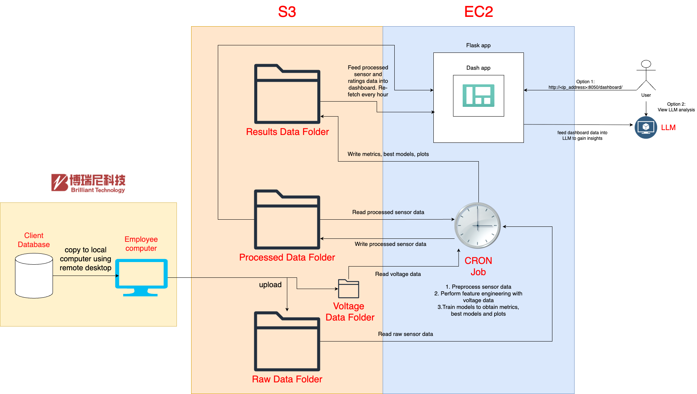

# **Brilliant Automation**

## **1. Getting Started**

### **Clone the Repository**

```bash
git clone https://github.com/Brilliant-Automation/capstone.git
cd capstone
```

### **Create and Activate the Environment**
Create the environment from the `environment.yml` file:

```bash
conda env create -f environment.yml
conda activate brilliant-auto-env
```


---

## **2. Makefile Usage**
> Use the provided `Makefile` to automate the modeling pipeline.

### **Available Commands**
| Command               | Description                                           |
|-----------------------|-------------------------------------------------------|
| `make all`            | Run the full pipeline: download → preprocess → train |
| `make download`       | Only download raw data                                |
| `make preprocess`     | Preprocess data for the specified device              |
| `make features`       | Extract features for the specified device             |
| `make train`          | Train models for the specified device                |
| `make clean`          | Clean temporary files                                 |
| `make tests`          | Run all test cases using `pytest`                    |
| `make proposal-report`| Generate the proposal report                          |
| `make final-report`   | Generate the final report  

---

### **Using `DEVICE`**
To process a different `DEVICE`, specify it on the command line:
```bash
DEVICE = 8#Belt Conveyer
```
---

## **3. Pipeline Scripts**
Each target in the Makefile maps directly to a Python or shell script.

| Target         | Script                                   | Example                                                          |
|----------------|-----------------------------------------|------------------------------------------------------------------|
| `preprocess`   | `python model/src/preprocess.py`        | `python model/src/preprocess.py --device "8#Belt Conveyer"`      |
| `features`     | `python model/src/feature_engineer.py`  | `python model/src/feature_engineer.py --device "Tube Mill"`      |
| `train`        | `python model/src/model.py`             | `python model/src/model.py --model all --device "Tube Mill"`     |

---

## **4. How to Generate the Proposal Report**

Follow these steps to generate the proposal report as a PDF:

### 1. **Run the Preprocessing Script**

Prepare the data required for the report by running the preprocessing script:

```bash
    python model/src/preprocess.py --device "8#Belt Conveyer"
```

This command processes the data for the specified device and prepares it for subsequent analysis.

### 2. **Run the EDA Notebook**

Execute the exploratory data analysis notebook to automatically generate all required plots:

```bash
    jupyter nbconvert --to notebook --execute notebooks/eda_conveyer_belt.ipynb
```

This runs all the cells in the notebook and updates it with the generated outputs.

### 3. **Generate the Proposal Report**

Convert the Quarto document into a PDF report using the following command:

```bash
  quarto render docs/reports/proposal.qmd --to pdf
```

The `proposal.pdf` file will be generated and saved in the `docs` directory.

---

## **5. How to Generate the Final Report**

Convert the Quarto document into a PDF report using the following command:

```bash
  quarto render docs/reports/final_report.qmd --to pdf
```

The `final_report.pdf` file will be generated and saved in the `docs` directory.

---

## **6. How to Run the Preprocessing Script**

The preprocessing script processes raw sensor and ratings data and outputs a merged dataset for further analysis.

###  **Supported Devices**

The script currently supports the following devices:

1. `1#High-Temp Fan`
2. `8#Belt Conveyer`
3. `Tube Mill`

### **Usage**

Run the script from the root directory:

``` bash
python model/src/preprocess.py --device "<device_name>" [--data_dir <data_directory>] [--output_dir <output_directory>]
```

#### **Arguments**

- `--device` (Required): Specify one of the supported device names (e.g. `8#Belt Conveyer`).
- `--data_dir` (Optional): Directory containing raw `.xlsx` files. Defaults to `Data/raw`.
- `--output_dir` (Optional): Directory to save the processed CSV file. Defaults to `Data/process`.

### **Examples**

1. To process data for `8#Belt Conveyer` using default directories:

   ```bash
   python model/src/preprocess.py --device "8#Belt Conveyer"
   ```

   Output:

   ```bash
   data/processed/8#Belt Conveyer_merged.csv
   model/src/preprocessing.log
   ```

2. To process data for `Tube Mill` using custom directories:

   ```bash
   python model/src/preprocess.py --device "Tube Mill" --output_dir custom_data/processed
   ```

---

## **7. How to Run Unit Tests**

The project includes comprehensive unit tests for the data processing pipeline. Tests are located in the `model/tests/` directory and cover preprocessing, feature engineering, and model functionality.

### **Running Tests**

From the root directory of the project:

```bash
# Navigate to the model directory
cd model

# Run preprocessing tests
python -m pytest tests/test_preprocess.py -v

# Run feature engineering tests  
python -m pytest tests/test_feature_engineer.py -v

# Run all tests at once
python -m pytest tests/ -v

# Run tests with coverage report
python -m pytest tests/ --cov=src --cov-report=html

# Run specific test function
python -m pytest tests/test_preprocess.py::test_log_dataframe_metadata -v
```

### **Test Coverage**

The test suite covers:

#### **Preprocessing Tests (`test_preprocess.py`)**
- **`test_log_dataframe_metadata`** - Tests logging functionality for dataframe metadata
- **`test_filter_datetime_range`** - Tests datetime filtering functionality

#### **Feature Engineering Tests (`test_feature_engineer.py`)**
- **DSP Processing Tests**
  - `test_read_json_file_*` - JSON file reading and validation
  - `test_band_rms` - RMS calculation in frequency bands
  - `test_band_peak` - Peak calculation in frequency bands
- **File Handling Tests**
  - `test_collect_json_files_local_mode` - JSON file collection from local directories
  - `test_read_merged_csv_local_mode` - CSV reading functionality
  - `test_save_csv_local_mode` - CSV saving functionality
- **Bucket Processing Tests**
  - `test_bucket_summary` - Time-based data bucketing and summarization
- **Parametrized Tests**
  - Multiple sampling rates and frequency bands
  - Different bucket intervals
- **Error Handling Tests**
  - Invalid file paths, malformed JSON, invalid parameters

### **Test Requirements**

Ensure you have the testing dependencies installed:

```bash
# Install testing dependencies (if not already installed)
conda activate brilliant-auto-env
pip install pytest pytest-cov

# Or install from requirements if available
pip install -r requirements-test.txt  # if exists
```

---

## **8. How to Run the Dashboard**

```bash
cd dashboard/src
python -m app
```

Go to `http://127.0.0.1:8050/dashboard/` to view the dashboard.

---

## **9. AWS Data Pipeline**

### Architecture Overview

Our AWS data pipeline provides an end-to-end solution for automated equipment health monitoring, leveraging cloud services for scalable data processing and machine learning model deployment.

#### **Technical Architecture**



**Key Components:**
- **Storage Layer**: AWS S3 for centralized data repository
- **Processing Layer**: AWS EC2 for data processing, feature engineering, and ML training
- **Application Layer**: Flask dashboard and automated scheduling

#### **AWS Services Used**

| Service | Purpose | Configuration |
|---------|---------|---------------|
| **Amazon S3** | Centralized data storage | Bucket: `brilliant-automation-capstone` |
| **Amazon EC2** | Compute infrastructure | Instance for processing and dashboard hosting |
| **AWS IAM** | Access management | Secure S3 and EC2 permissions |

### **Data Flow Architecture**

#### **S3 Bucket Structure**
```
brilliant-automation-capstone/
├── raw/                    # Raw sensor data (.xlsx files)
├── voltage/               # Compressed voltage data (.7z files)
│   ├── 20250401-8#Belt Conveyer/    # Extracted JSON files
│   ├── 20250402-8#Belt Conveyer/    
│   └── ...
├── processed/             # Processed datasets (.csv files)
│   ├── 8#Belt Conveyer_merged.csv
│   ├── 8#Belt Conveyer_full_features.csv
│   └── ...
└── results/               # ML results and artifacts
    ├── models/            # Trained models (.pkl files)
    ├── metrics/           # Performance metrics (.csv files)
    └── plots/             # Prediction visualizations (.png files)
```

#### **Pipeline Stages**

1. **Data Ingestion**: Raw sensor data uploaded to S3 `raw/` folder
2. **Preprocessing**: Sensor and rating data merged and synchronized
3. **Feature Engineering**: DSP metrics extracted from voltage data
4. **Model Training**: Multiple ML models trained with hyperparameter tuning
5. **Results Storage**: Models, metrics, and plots saved to S3 `results/` folder

### **Complete Runbook**

#### **Prerequisites**

1. **AWS Account Setup**
   - Valid AWS account with appropriate permissions
   - Obtain the required credentials from Brilliant Automation
   - AWS CLI configured with credentials

#### **Initial Setup**

##### **1. AWS Console Access**

1. **Access AWS Console**
   - Navigate to: [https://073680586744.signin.aws.amazon.com/console](https://073680586744.signin.aws.amazon.com/console)
   - Obtain username and password from Brilliant Automation
   - Login to access the AWS management console

2. **Obtain EC2 Instance Information**
   - Navigate to EC2 service in the AWS Console
   - Find the running instance and note the public IP address
   - Obtain the `ec2-access-key.pem` file from Brilliant Automation

3. **Access S3 Bucket**
   - Navigate to S3 service in the AWS Console
   - Search for and select the `brilliant-automation-capstone` bucket
   - Explore the folder structure:
     - `raw/` - Raw sensor data (.xlsx files)
     - `voltage/` - Compressed voltage data (.7z files) and extracted JSON files
     - `processed/` - Processed datasets (.csv files)
     - `results/` - ML results (models, metrics, plots)
   - Use the bucket for uploading new data or downloading results

##### **2. EC2 Instance Login**

```bash
# Set correct permissions for the key file
chmod 400 ~/Downloads/ec2-access-key.pem

# SSH into the EC2 instance
ssh -i ~/Downloads/ec2-access-key.pem ubuntu@<ip_address>

# Replace <ip_address> with the actual IP address from AWS Console
# Example: ssh -i ~/Downloads/ec2-access-key.pem ubuntu@54.175.183.157
```

**Note**: Obtain the `ec2-access-key.pem` file and IP address from Brilliant Automation team.

##### **3. EC2 Project Setup**

**Note**: The capstone project folder is already located at `/home/jupyter-ubuntu/capstone` on the EC2 instance.

1. **GitHub Access Setup**
   ```bash
   # Navigate to the project directory
   cd /home/jupyter-ubuntu/capstone
   
   # Generate SSH key pair for GitHub access
   ssh-keygen -t ed25519 -C "your_email@example.com"
   # Press Enter to accept default file location
   # Set a passphrase (optional but recommended)
   
   # Display the public key
   cat ~/.ssh/id_ed25519.pub
   ```

2. **Add SSH Key to GitHub Account**
   - Copy the output of the `cat ~/.ssh/id_ed25519.pub` command
   - Go to [GitHub SSH Settings](https://github.com/settings/keys)
   - Click "New SSH key"
   - Paste the public key and give it a descriptive title
   - Click "Add SSH key"

3. **Configure Git and Test Access**
   ```bash
   # Configure git (replace with your details)
   git config --global user.name "Your Name"
   git config --global user.email "your_email@example.com"
   
   # Test SSH connection to GitHub
   ssh -T git@github.com
   
   # Update remote URL to use SSH (if needed)
   git remote set-url origin git@github.com:Brilliant-Automation/capstone.git
   
   # Verify access by pulling latest changes
   git pull origin main
   ```

4. **Environment Setup**
   ```bash
   # Create conda environment (if not already created)
   conda env create -f environment.yml
   conda activate brilliant-auto-env

**Note**: Ensure you have the necessary permissions to access the [Brilliant-Automation/capstone](https://github.com/Brilliant-Automation/capstone) repository.

##### **4. EC2 JupyterHub Setup**

Access JupyterHub on browser:
- **URL**: http://<ip_address> (e.g., [http://54.175.183.157](http://54.175.183.157))
- **Username**: `ubuntu`
- **Password**: Obtain from Brilliant Automation team

**Note**: The JupyterHub interface provides direct access to the project environment and allows you to run notebooks, edit code, and manage files through a web browser.


#### **Pipeline Execution**

##### **Manual Execution**

1. **Run Complete Pipeline**
   ```bash
   # Make script executable
   chmod +x model/scripts/run_pipeline.sh
   
   # Execute full pipeline
   ./model/scripts/run_pipeline.sh
   ```

2. **Individual Pipeline Steps**
   ```bash
   # Step 1: Preprocessing (all devices)
   python model/src/preprocess.py --device "8#Belt Conveyer" --aws
   python model/src/preprocess.py --device "1#High-Temp Fan" --aws
   python model/src/preprocess.py --device "Tube Mill" --aws
   
   # Step 2: Feature Engineering
   python model/src/feature_engineer.py --device "8#Belt Conveyer" --aws
   
   # Step 3: Model Training (all models)
   python model/src/model.py --model Baseline --device "8#Belt Conveyer" --aws --tune
   python model/src/model.py --model Ridge --device "8#Belt Conveyer" --aws --tune
   # ... (continues for all 7 models)
   ```

##### **Automated Execution with Cron**

The cron job automatically runs the complete data pipeline every 6 hours, executing the following programs in sequence:
- **Data Preprocessing**: `preprocess.py` for all 3 devices (1#High-Temp Fan, 8#Belt Conveyer, Tube Mill)
- **Feature Engineering**: `feature_engineer.py` for 8#Belt Conveyer
- **Model Training**: `model.py` for all 7 models (Baseline, Ridge, PolyRidgeDegree2, RandomForest, XGBoost, SVR, RuleTree)

1. **Setup Cron Job**
   ```bash
   # Edit crontab
   crontab -e
   
   # Add daily pipeline execution (runs every 6 hours)
   0 */6 * * * PATH=/home/ubuntu/miniconda3/bin:/home/ubuntu/miniconda3/condabin:/usr/local/sbin:/usr/local/bin:/usr/sbin:/usr/bin:/sbin:/bin:/usr/games:/usr/local/games:/snap/bin /bin/bash -c '/home/jupyter-ubuntu/capstone/model/scripts/run_pipeline.sh >> /home/jupyter-ubuntu/capstone/model/scripts/logs/pipeline_$(date +\%Y\%m\%d_\%H\%M\%S).log 2>&1'
   ```

2. **Logging Directory**
   The logs of the Cron job is currently located in `/home/jupyter-ubuntu/capstone/model/scripts/logs`.

#### **Dashboard Deployment**

```bash
# Navigate to dashboard directory
cd dashboard/src

# Install dashboard dependencies (if not already installed)
conda activate brilliant-auto-env

# Run dashboard with AWS integration
python app.py --aws
```

After starting the dashboard, you can view it at: **http://<ip_address>:8050/dashboard/**

Example: [http://54.175.183.157:8050/dashboard/](http://54.175.183.157:8050/dashboard/)

**To run in background:**
```bash
# Run dashboard in background (keeps running even after closing terminal)
nohup python -m app --aws > /dev/null 2>&1 &

# To stop the dashboard later:
ps aux | grep python
kill <PID>
```

**Note**: Use `nohup` if you want to keep the dashboard running even after you close your AWS terminal session.
